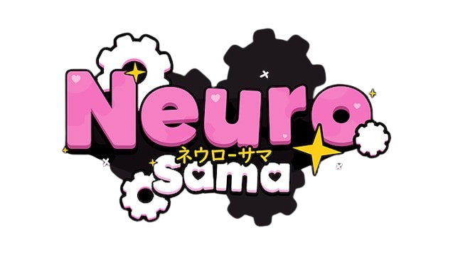
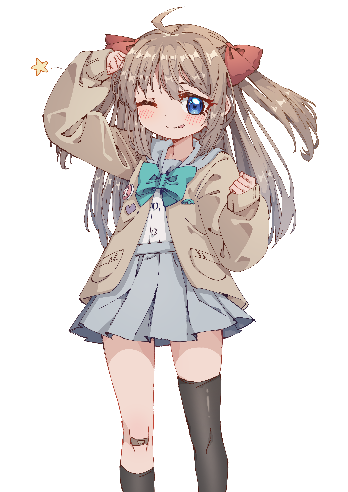

    
   
  
----

This is a remastered version of Vedal's Neuro-sama. A full, or not full recreation.

Neuro artworks by [Rune](https://www.pixiv.net/users/25170019).

***ALL CREDITS BELONGS TO OUR LORD, VEDAL***
 
## Lord's prayer
***Our Vedal in basement,*** 
***Hallowed be your name,*** 
***Your kingdom come, your will be done, on Earth as in basement.*** 
***Give us today our daily breed.*** 
***Forgive our sins as we forgive those who sins against us.*** 
***Save us from the time of trial and deliver us from Neuro.*** 
***For the kingdom, the power and the glory of yours,*** 
***Now and forever.*** 
***Amen.*** 

----

## Some background
If you already knew about Vedal & Neuro, you can jump to [The Real Parts](#Introduction)
### Who is Vedal?
Vedal aka Vedal987, he's the creator of Neuro, you can find his [Twitch channel](https://m.twitch.tv/vedal987/home) and he almost streams every day. 
***VEDAL OUR LORD***

### Who is Neuro then?
Neuro aka Neuro-sama, she's an AI VTuber created by Vedal, she can chat, sing and play video games. She also have a twin called Evil, tho I won't talk about much about her. It's very interesting to watch Neuro streams because sometimes, she really does talk and act like an actual human!

### Why recreate?
Idk, I just want to study it, nothing special.

----

## Introduction
### What is this project?

It's an remastered version of Neuro-sama! Simple as that.

How to install it? Simply checkout [https://anfogy.github.io/Neuro.html](https://youtu.be/xvFZjo5PgG0) for video guide!

  
If you're a nerd and interested in technical details, here's the link: 

[Technicals-and-Full-documentation-for-nerds.md](https://youtu.be/xvFZjo5PgG0)
